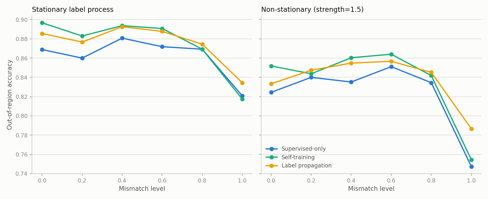

<div align="center">

# When Unlabelled Data Misleads

### Semi-Supervised Learning under Spatial Distribution Mismatch

Code companion to the manuscript in [`manuscript/main/`](manuscript/main/main.tex)

[](https://www.python.org/)
[](https://numpy.org/)
[](https://scipy.org/)
[](https://scikit-learn.org/)
[](https://pandas.pydata.org/)
[](https://matplotlib.org/)
[](https://jupyter.org/)
[](https://www.latex-project.org/)
[](https://wilds.stanford.edu/)

</div>

---

## Overview

Semi-supervised learning (SSL) assumes, usually implicitly, that labelled and
unlabelled data share a common marginal distribution. Spatial data routinely
violate this: labels are collected under pronounced sampling bias (surveys,
monitoring stations, administrative records cluster in accessible or
well-resourced areas), and the data carry spatial autocorrelation and
non-stationarity on top of that.

This repository implements the full experimental pipeline behind the
manuscript, which asks whether the cluster, manifold, and low-density-separation
assumptions that SSL methods rely on survive spatial marginal mismatch, and how
the resulting failure can be diagnosed and mitigated. It spans:

- a **controlled synthetic generator** with independently tunable mismatch,
  spatial autocorrelation, and non-stationarity axes (324 configurations),
- **benchmark validation** on PovertyMap-WILDS with its official
  country-level geographic split,
- **three further real-world datasets** — housing, socio-economic, and
  environmental monitoring — each run through an identical region-restriction
  mismatch sweep,
- a **ten-method comparison** spanning cluster-, graph-, consistency-, and
  geostatistical-SSL families,
- a **three-component distribution-aware framework** (density-ratio
  re-weighting, spatial weighting, adaptive pseudo-labelling), and
- **diagnostic tooling**: global and kernel-weighted localised divergence
  estimators, calibration analysis, and a segmented-regression changepoint
  analysis that locates the breakdown point formally.

## Key findings

| Hypothesis | Verdict | Headline evidence |
|---|---|---|
| **H1** — mismatch degrades SSL performance | Supported, threshold-like | Accuracy flat for α ≤ 0.6, then drops sharply; breakpoint fitted at **α ≈ 0.71–0.78** (segmented regression, bootstrap CI) |
| **H2** — cluster/manifold-reliant methods are more fragile | Partially supported, nuanced | Self-training drops most (**8.8 pp** synthetic, **15.3 pp** WILDS); label propagation is comparatively robust — contradicts a naive cluster-vs-manifold ordering |
| **H3** — spatially explicit models outperform non-spatial ones | Partially supported, sample-size-mediated | Spatial GNN (**4.0 pp** drop) and geostatistical SSL (**4.9 pp**) beat supervised-only (**7.5 pp**) on larger datasets; GNNWR is the *least* robust method overall (**14.5 pp**) — no covariate fallback once geography alone fails |
| **H4** — distribution-aware training mitigates the loss | Partially supported | Density-ratio re-weighting cuts the WILDS drop from **15.3 → 3.1 pp**; adding spatial weighting + adaptive pseudo-labelling makes the *average* outcome worse (**13.7 pp**) — reported as a genuine negative result |

Further headline results: spatial **non-stationarity degrades performance
independently of marginal mismatch**, costing ~4.5 pp even when the marginals
are identical; global divergence metrics (KL, MMD, Wasserstein) track
performance loss well (`r` up to −0.67), while a naive grid-localised MMD
collapses under severe mismatch (`r = −0.19`) — corrected here with a
kernel-weighted local estimator that more than doubles the correlation
(`r = −0.50`); and affected models don't just lose accuracy, they become
**miscalibrated**, with out-of-region expected calibration error roughly
doubling under maximal mismatch.

<p align="center">
  
</p>

## Repository structure

```
SSL/
├── manuscript/
│   ├── main/
│   │   ├── main.tex              Main manuscript (current version)
│   │   ├── supplementary.tex     Full extended methods + results (S1-S2)
│   │   ├── refs.bib              Bibliography
│   │   └── figures/              All manuscript figures
│   └── *.tex, draft*.tex         Earlier section-by-section drafts, kept for history
│
├── src/ssl_spatial/
│   ├── data/
│   │   ├── synthetic.py          Synthetic spatial data generator (mismatch/autocorrelation/non-stationarity)
│   │   ├── wilds_poverty.py      WILDS PovertyMap loader + feature engineering
│   │   ├── region_mismatch.py    Generic region-restriction mismatch sweep (shared by the 3 real datasets)
│   │   ├── housing.py            California Housing loader
│   │   ├── socioeconomic.py      USDA county poverty/income/education loader
│   │   └── air_quality.py        EPA AQS PM2.5 monitor loader
│   ├── metrics/
│   │   ├── divergence.py         KL, Wasserstein, MMD + fixed-grid and kernel-weighted localised versions
│   │   └── evaluation.py         Accuracy/F1, expected calibration error, spatial generalisation gap
│   ├── models/
│   │   ├── baselines.py          Supervised-only, self-training, label propagation
│   │   ├── distribution_aware.py Density-ratio reweighted self-training (H4)
│   │   ├── neural_ssl.py         Mean Teacher, FixMatch
│   │   ├── graph_ssl.py          Graph convolutional network + spatial-kernel GCN variant
│   │   ├── gnnwr.py              Geographically weighted neural network
│   │   ├── geostatistical.py     Geostatistical SSL (conditional-simulation pseudo-labelling)
│   │   └── method_registry.py    Unified fit_predict interface for all ten methods
│   ├── experiments/
│   │   ├── controlled_experiment.py    Synthetic sweep runner
│   │   ├── wilds_benchmark.py          WILDS PovertyMap sweep runner
│   │   ├── real_world_benchmark.py     Generic runner for housing/socioeconomic/air_quality
│   │   ├── spatial_methods_comparison.py  Ten-method comparison runner
│   │   ├── changepoint_analysis.py     Segmented-regression breakpoint fitting + bootstrap CIs
│   │   ├── localized_mmd_analysis.py   Fixed-grid vs. kernel-weighted localised MMD validation
│   │   └── plot_results.py             Figure generation
│   └── plotting.py
│
├── notebooks/
│   ├── benchmark.ipynb                    WILDS PovertyMap benchmark walkthrough
│   ├── real_world_benchmark.ipynb         Real-world datasets + distribution-aware framework walkthrough
│   └── spatial_methods_comparison.ipynb   Ten-method comparative study walkthrough
│
├── configs/            One YAML sweep definition per experiment (see table below)
├── results/            One CSV per config, plus findings_notes.md (gitignored except notes)
├── data/               Downloaded dataset caches (gitignored)
├── figures/            fig1-15, referenced directly by the manuscript
└── requirements.txt
```

## Methods compared

| Family | Methods | Notes |
|---|---|---|
| Baselines | Supervised-only, Self-training, Label propagation | Main-text focus; operationalise no/cluster/manifold assumptions |
| Distribution-aware | Re-weighted self-training, full 3-component framework | Density-ratio re-weighting + spatial weighting + adaptive pseudo-labelling |
| Consistency-based | Mean Teacher, FixMatch | Gaussian-noise perturbation in place of image augmentation |
| Graph-based | GCN, spatial-kernel GCN | Transductive, $k$-NN or Gaussian-weighted spatial graph |
| Spatially explicit | GNNWR | Geography-only, no covariate fallback |
| Geostatistical | Geostatistical SSL | Conditional-simulation pseudo-labelling, following Fouedjio & Talebi (2022) |

## Datasets

| Dataset | Domain | Geographic unit | Source |
|---|---|---|---|
| Synthetic generator | Controlled | Continuous 2D domain | `src/ssl_spatial/data/synthetic.py` |
| PovertyMap-WILDS | Satellite poverty mapping | Country (official split) | Koh et al. (2021), WILDS |
| California Housing | Housing/built environment | County (58) | Pace & Barry (1997), `sklearn` |
| USDA county data | Socio-economic | County (3,130) | USDA Economic Research Service |
| EPA AQS PM$_{2.5}$ | Environmental monitoring | State | US EPA Air Quality System |

## Installation

```bash
git clone https://github.com/Wiredu2020/Distributional-Mismatch-in-Spatial-SSL-Application.git
cd Distributional-Mismatch-in-Spatial-SSL-Application
pip install -r requirements.txt
```

Requires Python 3.9+. Core dependencies: `numpy`, `scipy`, `scikit-learn`,
`pandas`, `matplotlib`, `pyyaml`, `python-docx`, `wilds`, `requests`, `jupyter`.

## Reproducing the results

**Synthetic controlled experiment** (324 runs, ~2 minutes on a laptop CPU):

```bash
PYTHONPATH=src python -m ssl_spatial.experiments.controlled_experiment configs/controlled_experiment.yaml
PYTHONPATH=src python -m ssl_spatial.experiments.plot_results
```

**PovertyMap-WILDS benchmark** (after downloading images once — see
`notebooks/benchmark.ipynb` §3):

```bash
PYTHONPATH=src python -m ssl_spatial.experiments.wilds_benchmark configs/wilds_benchmark.yaml
```

**Real-world datasets** (housing, socio-economic, air quality):

```bash
PYTHONPATH=src python -m ssl_spatial.experiments.real_world_benchmark configs/housing_benchmark.yaml
PYTHONPATH=src python -m ssl_spatial.experiments.real_world_benchmark configs/socioeconomic_benchmark.yaml
PYTHONPATH=src python -m ssl_spatial.experiments.real_world_benchmark configs/air_quality_benchmark.yaml
```

**Distribution-aware framework (H4)**:

```bash
PYTHONPATH=src python -m ssl_spatial.experiments.controlled_experiment configs/controlled_experiment_h4.yaml
PYTHONPATH=src python -m ssl_spatial.experiments.wilds_benchmark configs/wilds_benchmark_h4.yaml
```

**Ten-method comparison** across all five datasets:

```bash
PYTHONPATH=src python -m ssl_spatial.experiments.spatial_methods_comparison configs/spatial_methods_comparison.yaml
```

**Changepoint analysis** (20-seed re-run + segmented regression):

```bash
PYTHONPATH=src python -m ssl_spatial.experiments.controlled_experiment configs/controlled_experiment_sensitivity.yaml
PYTHONPATH=src python -m ssl_spatial.experiments.changepoint_analysis
```

**Localised MMD validation** (fixed-grid vs. kernel-weighted):

```bash
PYTHONPATH=src python -m ssl_spatial.experiments.localized_mmd_analysis
```


## Citation

If you use this code or reference these findings, please cite the manuscript
in [`manuscript/main/main.tex`](manuscript/main/main.tex):

```bibtex
@unpublished{ssl_spatial_mismatch,
  title  = {When Unlabelled Data Misleads: Semi-Supervised Learning under
            Spatial Distribution Mismatch},
  note   = {Code and manuscript available at
            \url{https://github.com/Wiredu2020/Distributional-Mismatch-in-Spatial-SSL-Application}}
}
```
